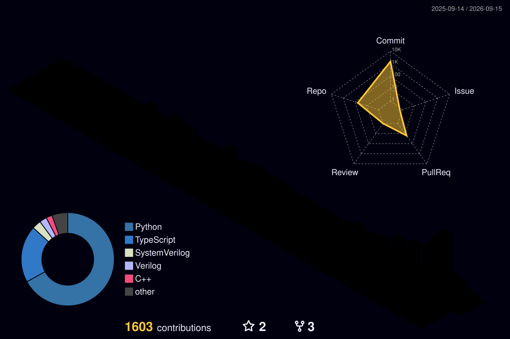

  

   

  
  
  

 

---

### 👨‍💻 **About Me**
> **"I build systems where hardware, firmware, and intelligence meet."**

I am an **Electronics & Communication Engineering Student** passionate about solving real-world problems through **low-power embedded systems** and **Edge AI**. I don't just write scripts; I architect complete solutions from the sensor node to the cloud dashboard.

* 🔭 **Working on:** Long-range LoRaWAN tracking & TinyML for microcontrollers.
* 🎓 **Studying:** Embedded Firmware Optimization & RTOS.
* 💼 **Goal:** Seeking Internship roles in Embedded Systems / IoT / Firmware Engineering.

---

### 🛠 **The Tech Arsenal**

<table align="center">
  <tr>
    <td align="center" width="96">
      
       Python
    </td>
    <td align="center" width="96">
      
       C++
    </td>
    <td align="center" width="96">
      
       Embedded C
    </td>
    <td align="center" width="96">
      
       Arduino
    </td>
    <td align="center" width="96">
      
       ESP32/IDF
    </td>
    <td align="center" width="96">
      
       Linux
    </td>
  </tr>
  <tr>
    <td align="center" width="96">
      
       TinyML
    </td>
    <td align="center" width="96">
      
       Git
    </td>
    <td align="center" width="96">
      
       LoRaWAN
    </td>
     <td align="center" width="96">
      
       VS Code
    </td>
    <td align="center" width="96">
      
       Streamlit
    </td>
    <td align="center" width="96">
      
       Actions
    </td>
  </tr>
</table>

---

### 🏆 **Featured Deployments**

| **Project** | **Description & Tech** | **Impact** |
| :--- | :--- | :--- |
| **🛰️ Vehicle Tracking System** | **Stack:** `ESP32` `GPS` `LoRaWAN` `Python`   A non-cellular tracking solution using LoRa for long-range telemetry. | Enabled real-time asset tracking in dead-zone areas without recurring SIM costs. |
| **⚡ Power Modeling Engine** | **Stack:** `Python` `Data Analysis` `Pandas`   Algorithmic modeling of battery depletion for remote sensor nodes. | Predicted device lifespan with **90% accuracy**, optimizing maintenance schedules. |
| **🤖 Edge AI Vision** | **Stack:** `TensorFlow Lite Micro` `ESP32-Cam`   Running object detection directly on-chip without cloud latency. | Reduced data transmission by **70%** by sending only alerts, not video streams. |

---

### 📊 **GitHub Intelligence**

  
  
  

 

  

---

### 📫 **Transmission Lines**

  
  
  

 

  <i>"Optimization is the root of all engineering."</i>

  

